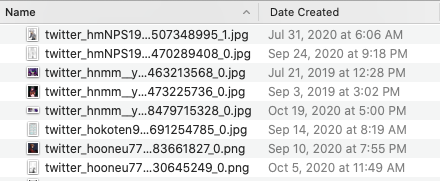

## Features
Base features:
- Exports your images from your liked tweets (on browser) into a JSON file (gifs and other animated media not included).
- Using the JSON file, fetches the tweet images and saves them with a naming convention that makes it easy to reconstruct the tweet URL.

Full features:
- Modifies the creation times of the saved tweet images to match the tweet upload date. 

## Requirements & Setup
### Windows
- Python 3.5+ for full functionality OR Python3+ for base functionality
- For full functionality: 
    - Create a Python virtualenv on Python3.5+ (call it "twfav" or whatever you'd like). If you've never created a virtualenv, follow [mkvirtualenv-win](https://pypi.org/project/virtualenvwrapper-win/) instructions.    
    - On your new virtualenv, run pip install win32-setctime
    - uncomment the `# Uncomment for Windows` section in `main.py`

### Mac
- Python 3+
- For full functionality:
    - uncomment the `# Uncomment for Mac` section in `main.py`

## Usage
The configs for this are a little rough, you may need to tweak some of the configs in `tweet_snippet.js`.

#### Getting the image information
- Go to your likes page: `https://twitter.com/<your account handle here>/likes`
- On your browser of choice, open up the Snippets panel. Google how to do this if you don't know how; on Chrome at least it's under Sources --> Snippets.
- Copy + paste the contents of `tweet_snippet.js` into a new Snippet.
- Right click on the Snippet to run it.

- When it is done running, your browser will prompt you to save the file. Save it in the same directory as this README.

- ⚠️ For Chrome at least, you must stay on the Twitter likes page. Switching to another tab or to another application will cause the script to quit early (because it keeps fetching image data until it can't scroll the page any further). So block out some time to let your computer spin and run this. ⚠️
- Depending on how many likes you have, this could take a long time. [Twitter allows you to fetch 180 times on the liked page per 15 minute period](https://developer.twitter.com/en/docs/twitter-api/v1/rate-limits). 
    - For example, on my browser + monitor, Twitter gives me 10 tweets every time I scroll further down ("10 tweets per batch"). 
    - This means I can fetch 10 * 180 = 1800 tweets per 15 minute period. Once you hit the 180 GET request limit, `tweet_snippet.js` will automatically impose a 15-minute cooldown.
    - So if I have 3000 liked tweets, I will hit one 15-minute cooldown period running this.
    - You can use these calculations to estimate how long this program will run on your liked page.
- You can adjust `delay` in `tweet_snippet.js` to match your internet/browser speed. If you're in a slow internet household, you will want to bump up `delay` to maybe 2x of how long it takes you to load a new part of your timeline.

#### Actually downloading the images
- Using python3+ (or while working on your virtualenv if you are on Windows), run `main.py`. This will take a while.
- Images will be populated under `/images`. 
- If using full functionality, file creation will also be updated to match the tweet upload date. Example:
 

#### Reconstructing the original tweet URL
The format of the image saved is `twitter_<account handle>_<status ID>_<batch number>`
* `account_handle`: what comes after @
* `status ID`: tweet identifier
* `batch number`: if the tweet has multiple images posted, batch_number corresponds to the individual images.

By default batch number is 0 for tweets with only one image.

 

Put all together, this matches the twitter URL format of `https://twitter.com/<account handle>/status/<status ID>`

Example: `twitter_dodonpahchi_1011217603698704384_0` becomes `https://twitter.com/dodonpahchi/status/1011217603698704384`, etc.

#### Notes
I set up the JSON image fetching via browser + JavaScript because I didn't want to deal with Twitter API's authentication and limits, but for people with a truly insane amount of images liked they want to download, Twitter API is probably a necessity or else their browser will crash. 